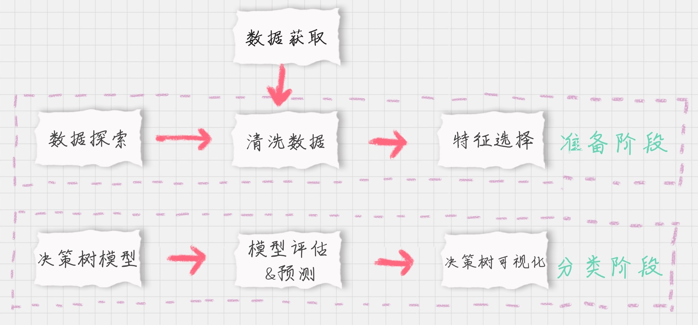
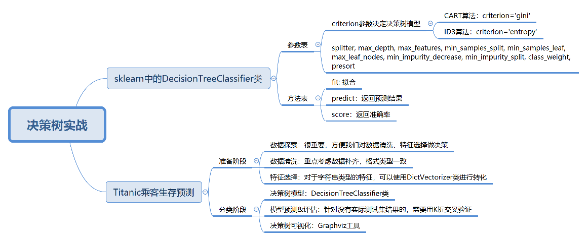

# 泰坦尼克乘客生存预测

决策树分类的应用场景非常广泛，在各个行业都有应用，比如在金融行业可以用决策树做贷款风险评估，医疗行业可以使用决策树生成辅助诊断，电商行业可以使用决策树对销售额进行预测等。

决策树算法是经常使用的数据挖掘算法，这是因为决策树就好像是一个人的大脑中的决策模型一样，呈现出来非常直观。基于决策树还产生了许多数据挖掘的算法，例如随机森林（Random Forest）。


## sklearn 中的决策树模型

首先，需要掌握的是sklearn中自带的决策树分类器DecisionTreeClassifier，方法如下：
```py
clf = DecisionTreeClassifier(criterion='entropy')
```
到目前为止，sklearn中只实现了ID3和CART决策树，所以我们暂时只能使用这两种决策树，在构造DecisionTreeClassifier类时，其中的一个参数是criterion，意思为标准。它决定了构造的分类树是采用ID3分类树，还是使用CART分类树，对应的取值分别是entropy或者gini：

- entropy：基于信息熵，也就是ID3算法，实际结果与C4.5相差不大；
- gini：默认参数，基于基尼系数。CART算法是基于基尼系数做属性划分的，所以criterion=gini时候，实际上执行的就是CART算法。


通过设置criterion='entropy'可以构建一个ID3决策树的分类器，然后打印下clf，看下决策树中sklearn中是个什么东西。


```python
DecisionTreeClassifier(class_weight=None, criterion='entropy', max_depth=None,
                       max_features = None, max_leaf_nodes=None,
                       min_impurity_decrease = 0.0, min_impurity_split=None,
                       min_samples_leaf=1, min_samples_split=2,
                       min_weight_fraction_leaf=0.0, presort=False, random_state=None,
                       splitter='best')
```

从上面可以看出分类器有很多参数，除了设置criterion采用不同的决策树算法之外，一般建议使用默认的参数，默认的参数不会限制决策树的最大深度，不限制叶子结点数，认为所有的分类的权重都相等等。当然，我们亦可以挑中这些参数，来创建不同的决策树模型。

一些参数的代表的涵义如下：
- 参数表------------------------ 作用
- criterion：在基于特征划分数据集的时候，选择特征的标准。默认是gini，也可以是entropy。
- splitter: 在构造树时候，选择属性特征的原则，可以是best或者是random。默认是best，best代表的是在所有的特征中选择最好的，random代表在部分特征中选择最好的。
- max_depth：决策树的最大深度，我么可以控制决策树的深度来防止决策树过拟合
- max_features:在划分数据集的时候考虑最多的特征值数量。为int或者float类型。其中int值是每次split时的最大特征数；float值是百分数，即特征数=max_features * n_features.
- min_samples_split:当结点的样本数少于min_samples_split时，不需要再继续分裂。默认值为2
- min_sample_leaf: 叶子结点需要的最少样本数。如果某叶子结点数目小于这个阈值，则会和兄弟结点一起被剪枝。min_sample_leaf的取值可以是int或者float类型。int类型：代表的是最小的样本数；float类型代表的是一个百分比，这是最小样本数=min_sample_leaf乘以样本数量，并向上取整。
- max_leaf_nodes:最大叶子节点数。int类型，默认为None。默认的情况下是不设置最大叶子节点数，特征不多的时候，不用设置。特征多的时候，可以通过设置最大的叶子节点数，防止过度拟合。
- min_impurity_decrease:结点划分最小不纯度。float类型，默认值为0.结点的不纯度必须大于这个阈值，否则该节点不再生成子节点。通过设置，可以限制决策树的增长。
- min_impurity_split:信息增益的阈值。信息增益必须大于这个阈值，否则不分裂。
- class_weight:类别权重。默认为Node，也可以是dict或者balanced。dict类型：指定样本各类别的权重，权重大的类别在决策树构造的时候会进行偏倚。balanced：算法自己计算权重，样本量少的类别所对应的样本权重会更高。
- presort：bool类型，默认是false，表示在拟合前，是否对数据进行排序来加快树的构建。当数据集较小的时候，使用presort=true会加快分类器的构造速度。当数据集庞大的时候，presort=true会导致整个分类非常缓慢。

在构造决策树分类器之后，我们可以使用fit方法让分类器进行拟合，使用predict方法对新数据进行预测，得到预测的分类结果，也可以使用score方法得到分类器的准确率。

下面的表格是fit方法、predict方法和score方法的作用：

|方法表|作用|
|--|--|
|fit(features,labels)|通过特征矩阵，分类标识，让分类器进行拟合|
|predict(features)|返回预测结果|
|score(features,labels)|返回准确率|


## Titanic 乘客生存预测

问题描述：预测乘客生存

目标：需要使用决策树分类对训练集进行训练，针对测试集中的乘客进行生存预测，并告知分类器的准确率！

资料1：两个数据集：
- train.csv 是训练数据集，包含特征信息和存活与否的标签
- test.csv:测试数据集，只包含特征信息。

资料2：在训练集中，包含一下字段，内涵为：

|字段|描述|
|--|--|
|PassengerId|乘客编号|
|Survived|是否幸存|
|Pclass|船票等级|
|Name|乘客姓名|
|Sex|乘客性别|
|SibSp|亲戚数量（兄妹、配偶数）|
|Parch|亲戚数量（父母子女数）|
|Ticket|船票号码|
|Fare|船票价格|
|Cabin|船舱|
|Embarked|登录港口|

### 生存预测的关键流程

我们要对训练集中乘客的生存进行预测，这个过可以划分为两个阶段：



1、**准备阶段：** 首先需要对训练集、测试集的数据进行探索,分析数据质量，并对数据进行清洗，然后通过特征选择对数据进行降维，方便后续分类的运算；

2、**分类阶段：** 首先需要通过训练集的特征矩阵、分类结果得到决策树的分类器，然后将分类器应用于测试集。然后我们对决策树分类器的准确性进行分析，并对决策树模型进行可视化。

#### 模块1：数据探索

数据探索这部分虽然对分类器没有实质作用，但是不可忽略。只有足够了解这些数据的特性，才能帮助我们做数据清洗、特征选择。

如何对数据进行探索，这里的一些函数我们需要掌握：
- 使用info()了解数据表的基本情况：行数，列数，每列的数据类型、数据完整度：
- 使用describe()了解数据表的统计情况：总数、平均值、标准差、最小值、最大值等；
- 使用describe(include=['O'])查看字符串类型（非数字）的整体情况；
- 使用head查看前几行数据（默认是前五行）；
- 使用tail查看后几行数据（默认是最后5行）。


这些探索，我们可以使用Pandas便捷的处理这些问题：


```python
import pandas as pd
# 数据加载
train_data = pd.read_csv('./Titanic_data/train.csv')
test_data = pd.read_csv('./Titanic_data/test.csv')
# 数据探索
print(train_data.info())
print('-'*30)
print(train_data.describe())
print('-'*30)
# 查看字符串类型（非数字）的整体情况
print(train_data.describe(include=['O']))
print('-'*30)
print(train_data.head())
print('-'*30)
print(train_data.tail())
```

    <class 'pandas.core.frame.DataFrame'>
    RangeIndex: 891 entries, 0 to 890
    Data columns (total 12 columns):
    PassengerId    891 non-null int64
    Survived       891 non-null int64
    Pclass         891 non-null int64
    Name           891 non-null object
    Sex            891 non-null object
    Age            714 non-null float64
    SibSp          891 non-null int64
    Parch          891 non-null int64
    Ticket         891 non-null object
    Fare           891 non-null float64
    Cabin          204 non-null object
    Embarked       889 non-null object
    dtypes: float64(2), int64(5), object(5)
    memory usage: 83.6+ KB
    None
    ------------------------------
           PassengerId    Survived      Pclass         Age       SibSp  \
    count   891.000000  891.000000  891.000000  714.000000  891.000000   
    mean    446.000000    0.383838    2.308642   29.699118    0.523008   
    std     257.353842    0.486592    0.836071   14.526497    1.102743   
    min       1.000000    0.000000    1.000000    0.420000    0.000000   
    25%     223.500000    0.000000    2.000000   20.125000    0.000000   
    50%     446.000000    0.000000    3.000000   28.000000    0.000000   
    75%     668.500000    1.000000    3.000000   38.000000    1.000000   
    max     891.000000    1.000000    3.000000   80.000000    8.000000   
    
                Parch        Fare  
    count  891.000000  891.000000  
    mean     0.381594   32.204208  
    std      0.806057   49.693429  
    min      0.000000    0.000000  
    25%      0.000000    7.910400  
    50%      0.000000   14.454200  
    75%      0.000000   31.000000  
    max      6.000000  512.329200  
    ------------------------------
                                    Name   Sex  Ticket    Cabin Embarked
    count                            891   891     891      204      889
    unique                           891     2     681      147        3
    top     Newsom, Miss. Helen Monypeny  male  347082  B96 B98        S
    freq                               1   577       7        4      644
    ------------------------------
       PassengerId  Survived  Pclass  \
    0            1         0       3   
    1            2         1       1   
    2            3         1       3   
    3            4         1       1   
    4            5         0       3   
    
                                                    Name     Sex   Age  SibSp  \
    0                            Braund, Mr. Owen Harris    male  22.0      1   
    1  Cumings, Mrs. John Bradley (Florence Briggs Th...  female  38.0      1   
    2                             Heikkinen, Miss. Laina  female  26.0      0   
    3       Futrelle, Mrs. Jacques Heath (Lily May Peel)  female  35.0      1   
    4                           Allen, Mr. William Henry    male  35.0      0   
    
       Parch            Ticket     Fare Cabin Embarked  
    0      0         A/5 21171   7.2500   NaN        S  
    1      0          PC 17599  71.2833   C85        C  
    2      0  STON/O2. 3101282   7.9250   NaN        S  
    3      0            113803  53.1000  C123        S  
    4      0            373450   8.0500   NaN        S  
    ------------------------------
         PassengerId  Survived  Pclass                                      Name  \
    886          887         0       2                     Montvila, Rev. Juozas   
    887          888         1       1              Graham, Miss. Margaret Edith   
    888          889         0       3  Johnston, Miss. Catherine Helen "Carrie"   
    889          890         1       1                     Behr, Mr. Karl Howell   
    890          891         0       3                       Dooley, Mr. Patrick   
    
            Sex   Age  SibSp  Parch      Ticket   Fare Cabin Embarked  
    886    male  27.0      0      0      211536  13.00   NaN        S  
    887  female  19.0      0      0      112053  30.00   B42        S  
    888  female   NaN      1      2  W./C. 6607  23.45   NaN        S  
    889    male  26.0      0      0      111369  30.00  C148        C  
    890    male  32.0      0      0      370376   7.75   NaN        Q  


#### 模块2：数据清洗

通过数据探索，我们发现Age、Fare和Cabin这三个字段的数据有所缺失。其中Age为年龄字段，是数值类型，我们可以通过平均值进行补齐；Fare为船票价格，是数值型，我们也可以通过其他人购买的船票的平均值进行补齐。

实现代码如下：


```python
import pandas as pd
# 数据加载
train_data = pd.read_csv('./Titanic_data/train.csv')
test_data = pd.read_csv('./Titanic_data/test.csv')
# 使用平均年龄来填充年龄中的NaN值
train_data['Age'].fillna(train_data['Age'].mean(),inplace=True)
test_data['Age'].fillna(test_data['Age'].mean(), inplace=True)
# 使用票价的均值来填充票价中的NaN值
train_data['Fare'].fillna(train_data['Fare'].mean(), inplace=True)
test_data['Fare'].fillna(test_data['Fare'].mean(), inplace=True)
print(train_data.head())
```

       PassengerId  Survived  Pclass  \
    0            1         0       3   
    1            2         1       1   
    2            3         1       3   
    3            4         1       1   
    4            5         0       3   
    
                                                    Name     Sex   Age  SibSp  \
    0                            Braund, Mr. Owen Harris    male  22.0      1   
    1  Cumings, Mrs. John Bradley (Florence Briggs Th...  female  38.0      1   
    2                             Heikkinen, Miss. Laina  female  26.0      0   
    3       Futrelle, Mrs. Jacques Heath (Lily May Peel)  female  35.0      1   
    4                           Allen, Mr. William Henry    male  35.0      0   
    
       Parch            Ticket     Fare Cabin Embarked  
    0      0         A/5 21171   7.2500   NaN        S  
    1      0          PC 17599  71.2833   C85        C  
    2      0  STON/O2. 3101282   7.9250   NaN        S  
    3      0            113803  53.1000  C123        S  
    4      0            373450   8.0500   NaN        S  


Cabin为船舱，有大量的缺失值。在训练集和测试集中的缺失率分别为77%和78%，无法补齐；Embarked为登录港口，有少量的缺失值，我们可以把缺失值补齐。

首先观察Embarked字段的取值，方法如下：


```python
import pandas as pd
# 数据加载
train_data = pd.read_csv('./Titanic_data/train.csv')
test_data = pd.read_csv('./Titanic_data/test.csv')
print(train_data['Embarked'].value_counts())
```

    S    644
    C    168
    Q     77
    Name: Embarked, dtype: int64


结果的意思就是：一共就有三个登录港口，其中S港口的人数最多，占到72%，因此我们将缺失的Embarked数值均设置为S：


```python
import pandas as pd
# 数据加载
train_data = pd.read_csv('./Titanic_data/train.csv')
test_data = pd.read_csv('./Titanic_data/test.csv')
print(train_data['Embarked'].value_counts())
# 使用平均年龄来填充年龄中的NaN值
train_data['Age'].fillna(train_data['Age'].mean(),inplace=True)
test_data['Age'].fillna(test_data['Age'].mean(), inplace=True)
# 使用票价的均值来填充票价中的NaN值
train_data['Fare'].fillna(train_data['Fare'].mean(), inplace=True)
test_data['Fare'].fillna(test_data['Fare'].mean(), inplace=True)
# 使用登录最多的港口来填充登录港口的NaN值
train_data['Embarked'].fillna('S', inplace=True)
test_data['Embarked'].fillna('S',inplace=True)
print('-'*30)
print(train_data.info())
print('-'*30)
```

    S    644
    C    168
    Q     77
    Name: Embarked, dtype: int64
    ------------------------------
    <class 'pandas.core.frame.DataFrame'>
    RangeIndex: 891 entries, 0 to 890
    Data columns (total 12 columns):
    PassengerId    891 non-null int64
    Survived       891 non-null int64
    Pclass         891 non-null int64
    Name           891 non-null object
    Sex            891 non-null object
    Age            891 non-null float64
    SibSp          891 non-null int64
    Parch          891 non-null int64
    Ticket         891 non-null object
    Fare           891 non-null float64
    Cabin          204 non-null object
    Embarked       891 non-null object
    dtypes: float64(2), int64(5), object(5)
    memory usage: 83.6+ KB
    None
    ------------------------------


从上面的结果可以看出，缺失的值补上了。

#### 模块3：特征选择
特征选择是分类器的关键。特征选择不同，得到的分类器也会不同。那么我们如何选择哪些特征做生存预测？

通过数据探索发现，PassengerId为乘客编号，对于分类没有作用，可以放弃；Name为乘客姓名，对分类没有作用，可以放弃；Cabin字段缺失值太多，可以放弃；Ticket字段为船票号码，杂乱无章且无规律，可以放弃；其余的字段包括：Pclass、Sex、Age、SibSp、Parch和Fare，这些属性分别表示了乘客的船票等级、性别、年龄、亲戚数量和船票价格，可能会和乘客的生存预测有关系。具体是什么关系，交给分类器来处理。

一次我们先将Pclass、Sex、Age等这些其余的字段作为特征，放到特征向量features里面。


```python
import pandas as pd
# 数据加载
train_data = pd.read_csv('./Titanic_data/train.csv')
test_data = pd.read_csv('./Titanic_data/test.csv')
print(train_data['Embarked'].value_counts())
# 使用平均年龄来填充年龄中的NaN值
train_data['Age'].fillna(train_data['Age'].mean(),inplace=True)
test_data['Age'].fillna(test_data['Age'].mean(), inplace=True)
# 使用票价的均值来填充票价中的NaN值
train_data['Fare'].fillna(train_data['Fare'].mean(), inplace=True)
test_data['Fare'].fillna(test_data['Fare'].mean(), inplace=True)
# 使用登录最多的港口来填充登录港口的NaN值
train_data['Embarked'].fillna('S', inplace=True)
test_data['Embarked'].fillna('S',inplace=True)
# 特征选择
features = ['Pclass', 'Sex', 'Age', 'SibSp', 'Parch', 'Fare', 'Embarked']
train_features = train_data[features]
train_labels = train_data['Survived'] # 加上一个生存标签
test_features = test_data[features]
```

特征值里面有一些是字符串，这样不方便后续的运算，需要转换成为数值类型，比如Sex字段，有male和female两种取值。我们可以把它变成Sex=male和Sex=female两个字段，数值使用的是0或者1来表示。

同理Embarked有S、C、Q三种可能，也可以改成Embarked=S、Embarked=C和Embarked=Q三个字段，数值使用0或者1来表示。

如何操作？我们可以使用sklearn特征选择中的DictVectorizer类，用它将可以处理符号化的对象，将符号转化成为数字0/1进行表示。方法如下：


```python
from sklearn.feature_extraction import DictVectorizer
dvec=DictVectorizer(sparse=False)
train_features=dvec.fit_trainsform(train_features.to_dict(orient='record'))
```

我们会看到代码中使用了fit_transform这个函数，它是可以将特征向量转化成为特征矩阵。然后我们看下dvec在转化之后的特征属性是怎样的，即查看dvec的feature_names_属性值，方法如下：


```python
print(dvec.feature_names_)
```

整合到上面的代码里面如下：


```python
import pandas as pd
from sklearn.feature_extraction import DictVectorizer

# 数据加载
train_data = pd.read_csv('./Titanic_data/train.csv')
test_data = pd.read_csv('./Titanic_data/test.csv')
# print(train_data['Embarked'].value_counts())
# 使用平均年龄来填充年龄中的NaN值
train_data['Age'].fillna(train_data['Age'].mean(),inplace=True)
test_data['Age'].fillna(test_data['Age'].mean(), inplace=True)
# 使用票价的均值来填充票价中的NaN值
train_data['Fare'].fillna(train_data['Fare'].mean(), inplace=True)
test_data['Fare'].fillna(test_data['Fare'].mean(), inplace=True)
# 使用登录最多的港口来填充登录港口的NaN值
train_data['Embarked'].fillna('S', inplace=True)
test_data['Embarked'].fillna('S',inplace=True)
# 特征选择（特征值矩阵）
features = ['Pclass', 'Sex', 'Age', 'SibSp', 'Parch', 'Fare', 'Embarked']
train_features = train_data[features]
train_labels = train_data['Survived'] # 加上一个生存标签
test_features = test_data[features]
# 转换类型
dvec=DictVectorizer(sparse=False)
train_features=dvec.fit_transform(train_features.to_dict(orient='record'))
# 查看效果
print(dvec.feature_names_)
```

    ['Age', 'Embarked=C', 'Embarked=Q', 'Embarked=S', 'Fare', 'Parch', 'Pclass', 'Sex=female', 'Sex=male', 'SibSp']


从上面的结果可以看到，原本一列的Embarked，变成了“Embarked=C”，“Embarked=Q”，“Embarked=S”三列。Sex列变成了“Sex=female” “Sex=male”两列。

这样train_features特征矩阵就包含10个特征值（列），以及891个样本（行），即891行，10列的特征矩阵。

#### 模块4：决策树模型
由上面的如何使用sklearn中的决策树模型，我们可以使用ID3算法，即在创建DecisionTreeClassifier时候，设置criterion=‘entropy’，然后使用fit进行训练，将特征值矩阵和分类标识结果作为参数传入，得到决策树分类器。

核心代码如下：


```python
from sklearn.tree import DecisionTreeClassifier
# 构造ID3决策树
clf = DecisionTreeClassifier(criterion='entropy')
# 拟合，决策树训练
clf.fit(train_features, train_labels)
```

整合上面的代码如下：


```python
import pandas as pd
from sklearn.feature_extraction import DictVectorizer
from sklearn.tree import DecisionTreeClassifier

# 数据加载
train_data = pd.read_csv('./Titanic_data/train.csv')
test_data = pd.read_csv('./Titanic_data/test.csv')
# print(train_data['Embarked'].value_counts())
# 使用平均年龄来填充年龄中的NaN值
train_data['Age'].fillna(train_data['Age'].mean(),inplace=True)
test_data['Age'].fillna(test_data['Age'].mean(), inplace=True)
# 使用票价的均值来填充票价中的NaN值
train_data['Fare'].fillna(train_data['Fare'].mean(), inplace=True)
test_data['Fare'].fillna(test_data['Fare'].mean(), inplace=True)
# 使用登录最多的港口来填充登录港口的NaN值
train_data['Embarked'].fillna('S', inplace=True)
test_data['Embarked'].fillna('S',inplace=True)
# 特征选择（特征值矩阵）
features = ['Pclass', 'Sex', 'Age', 'SibSp', 'Parch', 'Fare', 'Embarked']
train_features = train_data[features]
train_labels = train_data['Survived'] # 加上一个生存标签
test_features = test_data[features]
# 转换类型
dvec=DictVectorizer(sparse=False)
train_features=dvec.fit_transform(train_features.to_dict(orient='record'))
# 构造ID3决策树
clf = DecisionTreeClassifier(criterion='entropy')
# 拟合，决策树训练
clf.fit(train_features, train_labels)
```


    DecisionTreeClassifier(class_weight=None, criterion='entropy', max_depth=None,
                           max_features=None, max_leaf_nodes=None,
                           min_impurity_decrease=0.0, min_impurity_split=None,
                           min_samples_leaf=1, min_samples_split=2,
                           min_weight_fraction_leaf=0.0, presort=False,
                           random_state=None, splitter='best')


#### 模块5：模型预测&评估
在预测中，首先需要得到测试集的特征矩阵，然后使用训练好的决策树clf进行预测，得到预测结果pred_labels:


```python
test_features = dvec.transform(test_features.to_dict(orient='record'))
# 决策树预测
pred_labels = clf.predict(test_features)
```

在模型评估中，决策树提供了score函数可以直接得到准确率，但是我们并不知道真实的预测结果，所以就无法使用预测值和真实的预测结果做比较。我们只能使用训练集中的数据进行模型评估。可以使用决策树自带的score函数计算得到下面的结果：


```python
# 得到决策树的准确率
acc_decision_tree = round(clf.score(train_features, train_labels), 6)
print(u'score 准确率为 %.4lf' % acc_decision_tree)
```

将上面的代码整合如下所示：


```python
import pandas as pd
from sklearn.feature_extraction import DictVectorizer
from sklearn.tree import DecisionTreeClassifier

# 数据加载
train_data = pd.read_csv('./Titanic_data/train.csv')
test_data = pd.read_csv('./Titanic_data/test.csv')
# print(train_data['Embarked'].value_counts())
# 使用平均年龄来填充年龄中的NaN值
train_data['Age'].fillna(train_data['Age'].mean(),inplace=True)
test_data['Age'].fillna(test_data['Age'].mean(), inplace=True)
# 使用票价的均值来填充票价中的NaN值
train_data['Fare'].fillna(train_data['Fare'].mean(), inplace=True)
test_data['Fare'].fillna(test_data['Fare'].mean(), inplace=True)
# 使用登录最多的港口来填充登录港口的NaN值
train_data['Embarked'].fillna('S', inplace=True)
test_data['Embarked'].fillna('S',inplace=True)
# 特征选择（特征值矩阵）
features = ['Pclass', 'Sex', 'Age', 'SibSp', 'Parch', 'Fare', 'Embarked']
train_features = train_data[features]
train_labels = train_data['Survived'] # 加上一个生存标签
test_features = test_data[features]
# 训练集转换类型
dvec=DictVectorizer(sparse=False)
train_features=dvec.fit_transform(train_features.to_dict(orient='record'))
# 构造ID3决策树
clf = DecisionTreeClassifier(criterion='entropy')
# 拟合，决策树训练
clf.fit(train_features, train_labels)
# 测试集类型转换
test_features = dvec.transform(test_features.to_dict(orient='record'))
# 决策树预测
pred_labels = clf.predict(test_features)
# 得到决策树的准确率
acc_decision_tree = round(clf.score(train_features, train_labels), 6)
print(u'score 准确率为 %.4lf' % acc_decision_tree)
```

    score 准确率为 0.9820


从上面的结果可以看到，我么刚刚使用的训练集做训练，在使用训练集自身做准确率评估自然会很高。但是这样得出的准确率并不能代表决策树分类器的准确率。

这是为什么呢？

因为我们没有测试集的实际结果，因此无法使用测试集的预测结果与实际结果做对比。如果我们使用score函数对训练集的准确率进行统计，正确率会接近于100%（如上面的98.2%），无法对分类器的在实际环境下做出准确率的评估。

那么有什么方法，来统计决策树分类器的准确率？

这里可以使用K折交叉验证的方式，交叉验证是一种常用的验证分类准确率的方法，原理是拿出大部分的样本进行训练，少量的用于分类器的验证。K折交叉验证，就是做K次交叉验证，每次选取K分之一的数据作为验证，其余的作为训练。轮流K次，取到平均值。

K折交叉验证的原理：

1、将数据集平均分割成K个等份；
2、使用1份数据作为测试数据，其余的作为训练数据；
3、计算测试准确率；
4、使用不同的测试集，重复2,3步骤。

在sklearn中的model_selection模型选择中提供了cross_val_score函数。cross_val_score函数中的参数cv代表对原始数据划分成为多少份，也就是我们的K值，一般建议K取值10，因此可以设置CV=10，我们可以对比下score和cross_val_score两种函数的正确率的评估结果，核心代码：


```python
import numpy as np
from sklearn.model_selection import cross_val_score
# 使用K折交叉验证 统计决策树的准确率
print(u'cross_val_score准确率为 %.4lf' % np.mean(cross_val_score(clf, train_features, train_labels,cv=10)))
```

整合上面的代码如下：


```python
import pandas as pd
from sklearn.feature_extraction import DictVectorizer
from sklearn.tree import DecisionTreeClassifier
import numpy as np
from sklearn.model_selection import cross_val_score

# 数据加载
train_data = pd.read_csv('./Titanic_data/train.csv')
test_data = pd.read_csv('./Titanic_data/test.csv')
# print(train_data['Embarked'].value_counts())
# 使用平均年龄来填充年龄中的NaN值
train_data['Age'].fillna(train_data['Age'].mean(),inplace=True)
test_data['Age'].fillna(test_data['Age'].mean(), inplace=True)
# 使用票价的均值来填充票价中的NaN值
train_data['Fare'].fillna(train_data['Fare'].mean(), inplace=True)
test_data['Fare'].fillna(test_data['Fare'].mean(), inplace=True)
# 使用登录最多的港口来填充登录港口的NaN值
train_data['Embarked'].fillna('S', inplace=True)
test_data['Embarked'].fillna('S',inplace=True)
# 特征选择（特征值矩阵）
features = ['Pclass', 'Sex', 'Age', 'SibSp', 'Parch', 'Fare', 'Embarked']
train_features = train_data[features]
train_labels = train_data['Survived'] # 加上一个生存标签
test_features = test_data[features]
# 训练集转换类型
dvec=DictVectorizer(sparse=False)
train_features=dvec.fit_transform(train_features.to_dict(orient='record'))
# 构造ID3决策树
clf = DecisionTreeClassifier(criterion='entropy')
# 拟合，决策树训练
clf.fit(train_features, train_labels)
# 测试集类型转换
test_features = dvec.transform(test_features.to_dict(orient='record'))
# 决策树预测
pred_labels = clf.predict(test_features)
# 得到决策树的准确率
# acc_decision_tree = round(clf.score(train_features, train_labels), 6)
# print(u'score 准确率为 %.4lf' % acc_decision_tree)
# 使用K折交叉验证 统计决策树的准确率
print(u'cross_val_score准确率为 %.4lf' % np.mean(cross_val_score(clf, train_features, train_labels,cv=10)))
```

    cross_val_score准确率为 0.7846


由上面的结果可以看出，score函数的准确率是0.9820，cross_val_score准确率为0.7835

很明显，对于不知道测试集结实际结果的，需要使用K折交叉验证才能知道模型的准确率。

#### 模块6：决策树可视化
sklearn的决策树模型对于我们来说还是比较抽象的，但是可以使用Graphviz可视化工具帮助我们把决策树呈现出来。
引用代码如下：


```python
from sklearn import tree
import graphviz # sudo pip3 install graphviz 要先使用这个命令安装视图工具
import numpy as np

# 最后利用graphviz库打印出决策树图形
dot_data = tree.export_graphviz(clf,out_file=None)
graph = graphviz.Source(dot_data)
graph
```

整合上面的代码如下：


```python
import pandas as pd
from sklearn.feature_extraction import DictVectorizer
from sklearn.tree import DecisionTreeClassifier
import numpy as np
from sklearn.model_selection import cross_val_score
from sklearn import tree
import graphviz 

# 数据加载
train_data = pd.read_csv('./Titanic_data/train.csv')
test_data = pd.read_csv('./Titanic_data/test.csv')
# print(train_data['Embarked'].value_counts())
# 使用平均年龄来填充年龄中的NaN值
train_data['Age'].fillna(train_data['Age'].mean(),inplace=True)
test_data['Age'].fillna(test_data['Age'].mean(), inplace=True)
# 使用票价的均值来填充票价中的NaN值
train_data['Fare'].fillna(train_data['Fare'].mean(), inplace=True)
test_data['Fare'].fillna(test_data['Fare'].mean(), inplace=True)
# 使用登录最多的港口来填充登录港口的NaN值
train_data['Embarked'].fillna('S', inplace=True)
test_data['Embarked'].fillna('S',inplace=True)
# 特征选择（特征值矩阵）
features = ['Pclass', 'Sex', 'Age', 'SibSp', 'Parch', 'Fare', 'Embarked']
train_features = train_data[features]
train_labels = train_data['Survived'] # 加上一个生存标签
test_features = test_data[features]
# 训练集转换类型
dvec=DictVectorizer(sparse=False)
train_features=dvec.fit_transform(train_features.to_dict(orient='record'))
# 构造ID3决策树
clf = DecisionTreeClassifier(criterion='entropy')
# 拟合，决策树训练
clf.fit(train_features, train_labels)
# 测试集类型转换
test_features = dvec.transform(test_features.to_dict(orient='record'))
# 决策树预测
pred_labels = clf.predict(test_features)
# 得到决策树的准确率
# acc_decision_tree = round(clf.score(train_features, train_labels), 6)
# print(u'score 准确率为 %.4lf' % acc_decision_tree)
# 使用K折交叉验证 统计决策树的准确率
print(u'cross_val_score准确率为 %.4lf' % np.mean(cross_val_score(clf, train_features, train_labels,cv=10)))

# 最后利用graphviz库打印出决策树图形
dot_data = tree.export_graphviz(clf,out_file=None)
graph = graphviz.Source(dot_data)
# graph # 如果想要显示决策树，取消注释，重新运行即可
```

    cross_val_score准确率为 0.7813


### 决策树模型使用技巧总结

需要注意一下几点：
- 1、特征选择是分类模型好坏的关键。选择什么样的特征，以及对应的特征值矩阵，决定了分类模型的好坏。通常情况下，特征值不都是数值类型，可以使用DictVectorizer类进行转化；
- 2、模型准确率需要考虑是否有测试集的市价结果可以做对比，当测试集没有正式结果做对比的时候，需要使用K折交叉验证cross_val_score；
- 3、Graphviz可视化工具可以很方便的将决策模型呈现出来，以帮助更好的理解决策树的构建。



#### 思考题：
在构造特征向量的时候使用DictVectorizer类，使用fit_transform函数将特征向量转化成为特征矩阵。DictVectorizer类同时也提供了transform函数，那么这两个函数区别是什么？

- ans：
    - fit 从一个训练集中学习模型参数，区中就包括了归一化是用到的均值，标准偏差等，可以理解为一个训练的过程。
    - transform：在fit的基础上，对数据进行标准化，降维，归一化等数据转换操作
    - fit_transform：将模型训练和转化合并在一起，训练样本先做fit，得到mean。standard deviation，然后将这些参数用于transform（归一化训练数据），得到的训练数据是归一化的，而测试数据只需要在原先fit得到的mean，std上来做归一化就行，所以用transform就行了。
    - transform和fit_transform虽然结果相同，但是不能互换。因为fit_transform 只是fit+transform两个步骤合并的简写。而各种分类算法都需要先fit，然后再进行transform。如果把fit_trasform替换成transform就可能报错。


